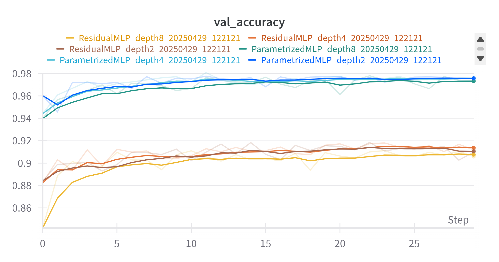
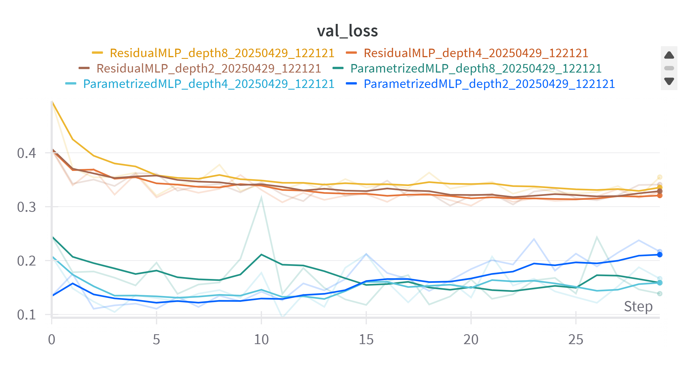
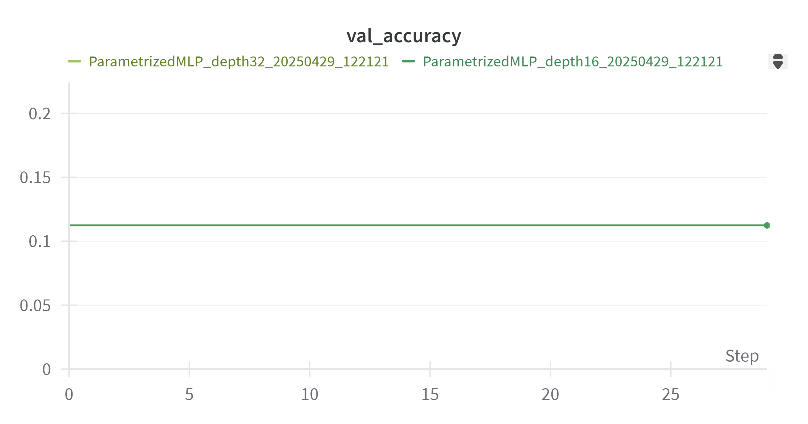
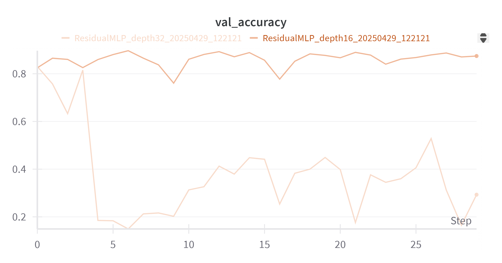
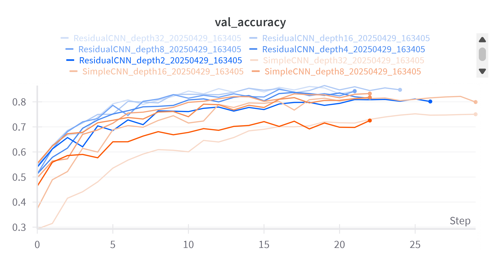

# David Megli - Deep Learning Applications Lab 1

This project is an implementation of Lab 1 for the Deep Learning Applications course in the Master's Degree in Artificial Intelligence at the University of Florence.

The code is in the python files (not in the jupyter notebooks).

The project is structured as follows:

- ```train.py```: contains the implementation of the training pipeline and the evaluation function. The train function takes as input the configuration file, uses the utility functions to load dataset, loss, optimizer and scheduler, and calls the train function of the Trainer class.
- ```utils.py```: contains the utility functions to load the configurations from a yaml configuration file, load a model from a model zoo, get an optimizer, a loss and a scheduler.
- ```trainer.py```: contains the Trainer class, which takes the model, the dataloaders, the loss function, the optimizer, the scheduler, and every other parameter from the configuration file, and does the training. It can handle backbone freezing, checkpoint saving/loading, saving of best model.
- ```models/model.py```: contains the implemented models.
- ```dataset/utils.py```: contains the function to load datasets specified in the config file, and get training, validation and testing dataloaders.
- ```configs``` folder: contains the .yaml configuration files, where you can choose: model to be used, dataset, optimizer, loss function, scheduler, each with its parameters, and the training settings.
- ```output``` folder: will contain the outputs of the scripts.

# Exercises
Following the instructions you will be able to reproduce the results (hopefully).

## Exercise 1.1
The "simple" MLP  is implemented in ```models/model.py```. I implemented the training pipeline in ```train.py``` and ```trainer.py```.

SimpleMLP is a working version of a simple MLP with just 1 layer and fixed dimensions.
Then I wrote the ParametrizedMLP to be able to instantiate a parametrized version of the MLP, and test different versions of it (deeper, shallow, larger, ...).

I tried to write a training function as generalized as possible: the training function takes as input a configuration file, it reads the parameters and dinamically gets model, loss function, optimizer and scheduler calling the corresponding utility functions.

## Exercise 1.2

### Usage
1. Edit network and training configurations in "base_config.yaml". Set use_wandb to False if you are not into Weights & Biases.
2. Run ```python run_experiments.py``` By default it will train a MLP and a Residual MLP, at different depths (2, 4, 8, 16, 32)
3. Wait
4. The script will save a "result.csv" file and 2 plot (.png) visualizing the comparison of loss and accuracy at different depths, for both networks. The files will be located in the "outputs/experiments" folder.

### Description

I first implemented the ResidualBlock class, a block that contains a parametrized number of fully connected layers, followed by activation functions, that during the forward pass provide as output the sum of the input and output of the network. I apply a projection (a linear layer) in case the input and output size differ.

I then built a parametrized Residual MLP that takes as input the input, hidden and output sizes, plus the desired number of residual blocks. In this way it is possibile to vary the depth of the network by changing the number of residual blocks.

### Results
Here we can appreciate some of the results.
As we can see, from depths of 2 to 8 the standard MLP reaches higher accuracies than the Residual MLP. 


From the following plot we can see that the standard MLP is more unstable compared to the Residual MLP, which is expected.
The standard MLP with depth 2 overfits on the training set.



In the following plot we can see how the MLP, at depths of 16 and 32, is learning nothing, which is also expected, and is the reason why we use residual connections.



Here we can see the accuracy of the Residual MLP at depth 16 and 32. The residual connections are improving the ability of the network to learn and maintain information even at greater depths. However we see that at the depth of 32 the accuracy still drops after a few epochs, meaning that for greater depths even residual connection are not enough.




## Exercise 1.3

### Usage

1. Edit network and training configurations in "base_cnn_config.yaml". Set use_wandb to False if needed.
2. Run ```python run_cnn_experiments.py```By default it will train a CNN and a Residual MLP uses ResNet BasicBlock, at different depths (2, 4, 8, 16, 32)
3. Wait
4. The script will save a "result.csv" file and 2 plot (.png) visualizing the comparison of loss and accuracy at different depths, for both networks. The files will be located in the "outputs/cnn_experiments" folder.

### Description
### Results



## Exercise 2.1
For this part I've used a pretrained ResidualCNN (width=64, depth=32) from the previous exercise
1. Move the checkpoint obtained from the previous exercise
2. Run the extract_features.py script, passing the checkpoint path as argument, e.g.: ```python extract_features.py --checkpoint_path residualcnn_checkpoint.pth```. It will generate a "cifar100_features.npz" file in the "outputs/features" folder (or in the path you specified as --output_dir)
3. Run ```python evaluate_baselines.py``` to evaluate Linear SVM, KNN and Gaussian Naive Bayes using the previous network as a feature extractor (i.e. using the previously extracted features). This will generate a "baseline_results.csv" file in the "outputs" folder.
4. Create or edit config files to finetune your pretrained network. You can find example configs in the "config" folder.
This example:
```
python train.py --config configs/cnn_finetune_fc_adam.yaml
python train.py --config configs/cnn_finetune_fc_SGD.yaml
python train.py --config configs/cnn_finetune_full_adam.yaml
python train.py --config configs/cnn_finetune_full_SGD.yaml
python train.py --config configs/cnn_finetune_progressive_adam.yaml
python train.py --config configs/cnn_finetune_progressive_SGD.yaml
```
 finetunes a ResidualCNN pretrained on CIFAR-10, on CIFAR-100, with 3 techniques (frozen backbone, full network finetuning, progressive block unfreezing) and 2 optimizers (Adam and SGD)